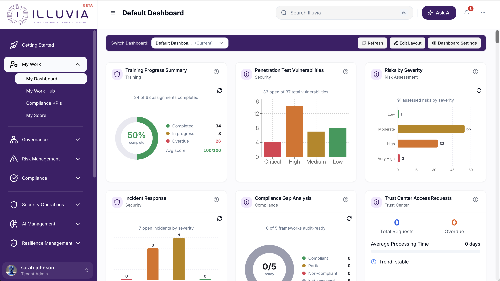
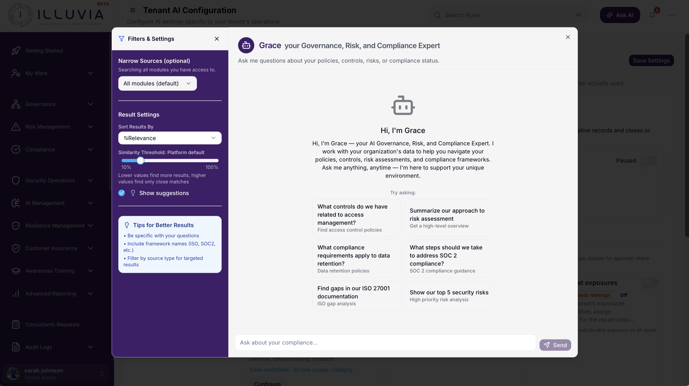
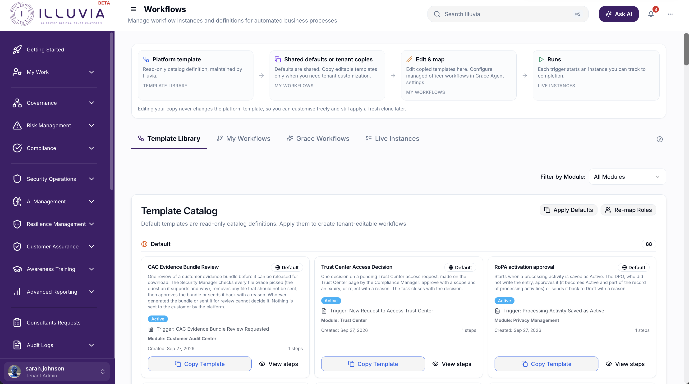
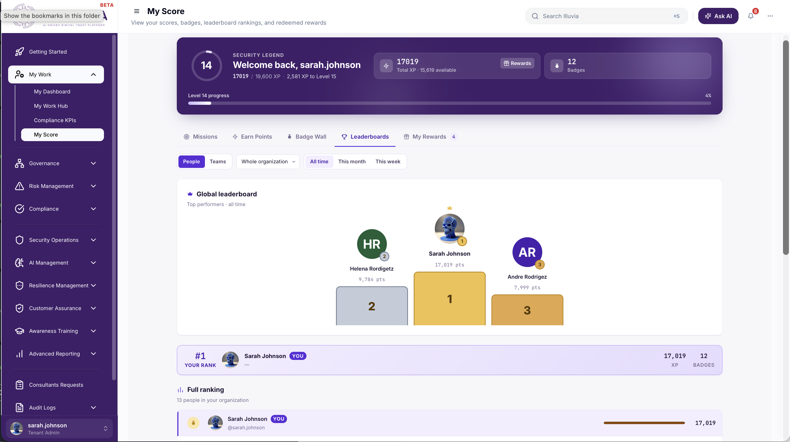
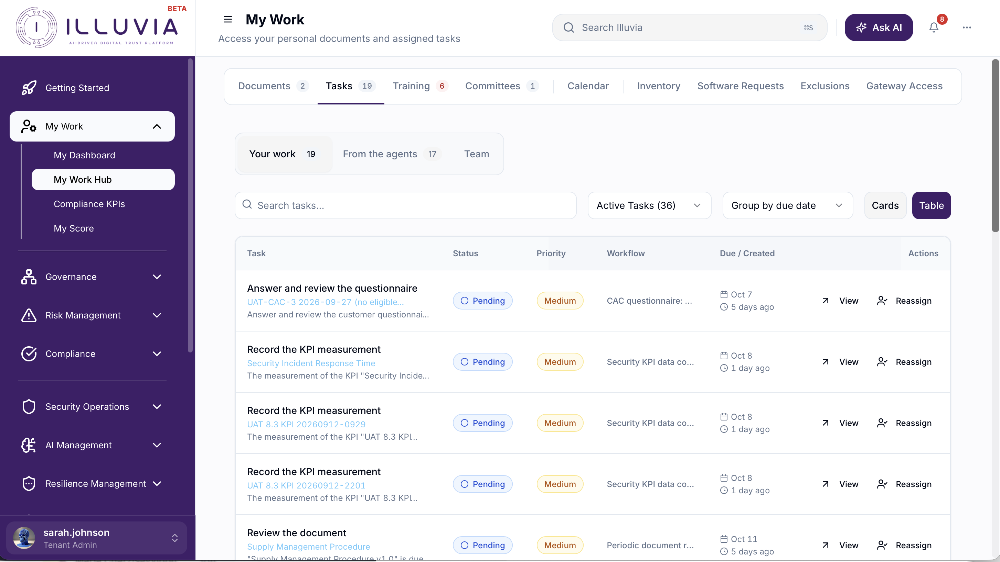
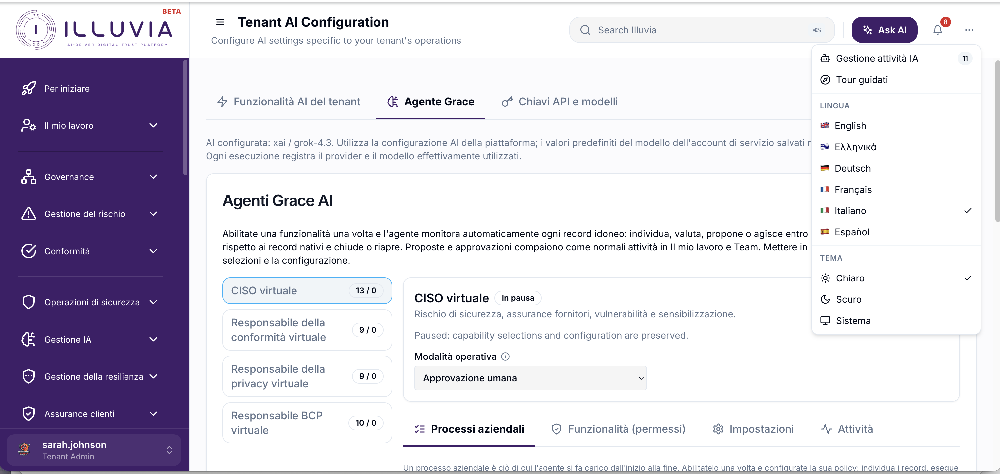
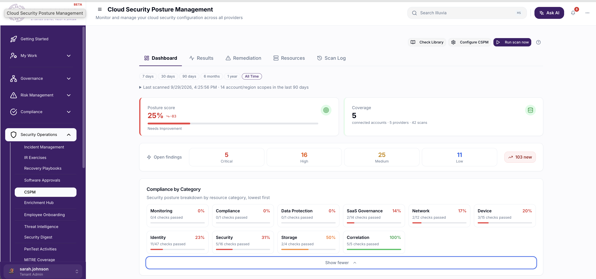

  

  <strong>Continuous trust. Calm operations.</strong>

  <a href="https://www.illuvia.io/"><strong>Explore illuvia.io →</strong></a>
  &nbsp;·&nbsp;
  <a href="https://www.illuvia.io/#features">Platform capabilities</a>
  &nbsp;·&nbsp;
  <a href="https://www.illuvia.io/#integrations">Integrations</a>

  
  
  

---

## Trust should be continuous

**Illuvia is an AI-augmented digital trust platform for modern security, risk, privacy and compliance teams.** It unifies governance, risk and compliance (GRC) with security operations—so risk signals, controls, cloud findings, evidence, remediation and customer assurance no longer live in separate systems.

Where conventional GRC tooling can leave teams manually collecting proof after the fact, Illuvia connects the operational work to the compliance outcome. **Grace**, Illuvia’s AI teammate, helps teams analyse context, create and execute workflows, prepare evidence, surface gaps and keep the right people moving—while people retain control of approvals and decisions.

The result is a trusted environment that is easier to govern, easier to prove and continuously audit-ready. From ISO 27001, SOC 2 and NIST CSF compliance to cloud security posture management, vendor risk management and business continuity, Illuvia gives leaders a connected operating model for digital trust.

> **Built for the way you operate.** Run Illuvia as a secure multi-tenant SaaS platform, or deploy it privately within your organisation’s own environment and intranet. The same digital trust operating model can support a single business, distributed teams, consultants and enterprise programmes.

| One platform | One source of truth | One calmer way to operate |
| :--- | :--- | :--- |
| Risk, compliance and security operations work in concert. | Controls, evidence, assets and findings stay connected. | Grace automates the busywork behind repeatable trust. |

  

One role-aware dashboard: training, penetration-test findings, risk, incidents and compliance gaps in a single live view.

---

## One control graph. The full digital trust picture.

Illuvia starts with **GRC at the core** and connects every surrounding trust domain to the same control graph. A cloud misconfiguration, an overdue access review or a supplier finding does not stop as an isolated alert: it can be assessed as risk, assigned to an owner, mapped to the affected controls and frameworks, remediated through a workflow, and retained as audit-ready evidence.

| **Risk & compliance** | **Customer assurance** | **Vendor & third-party risk** |
| :---: | :---: | :---: |
| **Identity & access** | **◉ GRC CONTROL GRAPH** | **Cloud CSPM** |
| **Privacy & data** | **Resilience · BCP / DR** | **Security operations** |

Every module orbits the same GRC control graph—mapped, owned, evidenced and connected—so one decision improves the whole trust programme.

---

## The digital trust operating system

### 01 — Risk, controls & compliance

**Make risk decisions that stand up to scrutiny.** Assess, prioritise and treat cyber, operational, vendor and technology risk using ISO 27005 context, NIST SP 800-30 methods and quantitative FAIR analysis. Model inherent and residual exposure, define risk appetite and KRIs, link controls and owners, and turn treatment decisions into accountable remediation. The same risk record can connect to assets, services, threats, findings, evidence and regulatory requirements—giving CISOs and risk owners a defensible view of enterprise risk management.

| **26** | **2,791** | **582** |
| :---: | :---: | :---: |
| supported compliance frameworks | mapped compliance requirements | reusable control baselines |

| **Risk assessments** | **Enterprise risk management** | **FAIR quantitative analysis** |
| :---: | :---: | :---: |
|  |  |  |

| **NIST risk assessments** | **Controls blast radius** | **Gap assessments** |
| :---: | :---: | :---: |
|  |  |  |

| **Compliance assurance** | **MITRE ATT&CK coverage** | **Legal & regulatory tracking** |
| :---: | :---: | :---: |
|  |  |  |

| **Compliance calendar** | **ISMS document management** | **Policy & document detail** |
| :---: | :---: | :---: |
|  |  |  |

### 02 — Audit, evidence & assurance

**Turn audit preparation into an operating rhythm.** Plan internal and external audits, manage audit scopes and schedules, send questionnaires, collect evidence, track observations and coordinate remediation in one audit management workspace. Grace helps reviewers analyse evidence and prepare questionnaire responses, while documented approvals, timestamps and source links preserve a clear audit trail. Teams can collect evidence once and reuse it across recurring audits, customer assurance requests and multiple compliance frameworks.

| **Audit management** | **Audit scheduling** |
| :---: | :---: |
|  |  |

| **Audit questionnaires** | **Questionnaire responses** |
| :---: | :---: |
|  |  |

### 03 — Asset, service & data intelligence

**See what you own, what it supports and what it touches.** Maintain a living CMDB-style asset and service registry with ownership, criticality, dependencies, lifecycle and business context. Pair it with data privacy management and a data registry to record processing activities, DPIAs, data subject requests and privacy responsibilities. This connected inventory makes compliance, cyber risk, service resilience and data protection decisions more accurate because every control is grounded in the systems and information it protects.

| **Asset registry** | **Service catalogue** | **Service threat modelling** |
| :---: | :---: | :---: |
|  |  |  |

| **Data registry** | **Data privacy management** |
| :---: | :---: |
|  |  |

| **Records of processing (ROPA)** | **DPIA management** |
| :---: | :---: |
|  |  |

### 04 — Resilience & business continuity

**Prepare, test and improve continuity before an incident demands it.** Bring business impact analysis (BIA), business continuity planning (BCP), disaster recovery (DR), recovery priorities, RTO/RPO targets, scenario exercises and test evidence into one governed resilience programme. Link critical services, dependencies, risks and controls to the plans that protect them, so resilience leaders can prove readiness and improve recovery capability before disruption occurs.

| **BCP management** | **BCP plan** | **Recovery playbooks** |
| :---: | :---: | :---: |
|  |  |  |

### 05 — Grace AI & workflow automation

**Give trust work an intelligent teammate.** Grace is Illuvia’s AI teammate for governance, risk, compliance and security operations. She can analyse control context, draft remediation plans, create and execute workflows, schedule access reviews, prepare evidence requests and surface likely audit gaps. Configurable no-code workflows orchestrate approvals, tasks, reminders, notifications and hand-offs across teams—while human owners remain responsible for decisions and sign-off.

| **Grace AI chat** | **Virtual agents** | **Workflow automation** |
| :---: | :---: | :---: |
|  |  |  |

### 06 — Security awareness & phishing

**Make security culture measurable.** Run targeted security awareness programmes and phishing simulations, monitor participation, learning progress and human-risk signals, and turn the results into focused follow-up. Security leaders can align training campaigns to policy, threat and regulatory requirements, demonstrating that awareness is an operating control—not a once-a-year checkbox exercise.

| **Awareness training** | **Phishing campaigns** | **Gamification** |
| :---: | :---: | :---: |
|  |  |  |

### 07 — Dashboards & executive insight

**Give every stakeholder the view they need.** Build role-aware customer, executive and operational dashboards from configurable widgets for compliance progress, open audit findings, risk assessment, incidents, training, penetration-test vulnerabilities and more. Real-time metrics, trend analysis and AI-generated executive briefings transform live records into a concise, evidence-backed view of security posture, compliance health and programme performance.

| **Illuvia Intelligence** | **AI executive briefings** | **Automated compliance KPIs** |
| :---: | :---: | :---: |
|  |  |  |

| **Report builder** | **My Work** | **Multilanguage** |
| :---: | :---: | :---: |
|  |  |  |

### 08 — Cloud security posture management

**Connect cloud posture to the controls it affects.** Continuously assess AWS, Microsoft Azure and Google Cloud environments with **600+ security checks**, baseline mapping, configuration-drift awareness and evidence promotion. Cloud security posture management (CSPM) findings become accountable remediation work, linked controls and audit-grade evidence rather than disconnected alerts—helping cloud security, DevSecOps and compliance teams work from the same posture.

| **Cloud security posture** |
| :---: |
|  |

### 09 — Trust Center & third-party risk

**Make assurance easier to share and supplier risk easier to govern.** Use a configurable Trust Center to present a clear, current and customer-friendly view of your security and compliance assurance posture. Manage third-party and vendor risk with tiering, workflows, questionnaires, documents, assessment context, security scoring and active intelligence. Supplier decisions remain connected to the wider enterprise risk programme, so teams can understand which vendors support critical services and which controls, data or obligations they affect.

| **Trust Center** | **Vendor management** | **Vendor perimeter scoring** |
| :---: | :---: | :---: |
|  |  |  |

### 10 — Identity, people & security validation

**Keep access, workforce events and technical assurance in the same picture.** Support single sign-on (SSO) with Microsoft Entra ID (Azure AD), Okta and Google; connect HR systems to automate joiner/mover/leaver controls and user-access auditing; and manage penetration testing from scope and findings to remediation and reporting. These identity, people and technical assurance signals feed the same risk and compliance programme, making it easier to demonstrate access governance and security validation to auditors and customers.

| **User access review** | **Employee onboarding** | **External consultant access** |
| :---: | :---: | :---: |
|  |  |  |

### 11 — Penetration test results management

**Turn penetration-testing reports into verified risk reduction.** Plan penetration tests, define scope, record engagements and securely capture findings from internal teams or external testing partners. Triage vulnerabilities by severity and business impact, assign owners, track remediation due dates and validate closure with evidence. Penetration-test results connect directly to assets, services, controls, risks and executive dashboards—so technical findings become measurable security improvement rather than a PDF that is forgotten after delivery.

| **Pen-test programme** | **Findings & remediation** |
| :---: | :---: |
|  |  |

### 12 — Incident management, playbooks & IR exercises

**Respond with clarity when security events matter.** Coordinate incident response from detection through containment, eradication, recovery and post-incident review. Create repeatable incident response playbooks, assign tasks and escalation paths, manage communications and retain an evidence-rich timeline for regulators, auditors and leadership. Plan and record tabletop exercises and technical IR drills to test readiness, capture lessons learned and strengthen the controls, continuity plans and response procedures that protect the business.

| **01 · Incident workspace** | **02 · Response playbook** | **03 · IR exercise** |
| :---: | :---: | :---: |
| `Add incident case screenshot` | `Add response playbook screenshot` | `Add tabletop exercise screenshot` |

### 13 — Customer security questionnaires & AI answers

**Answer customer assurance requests faster, without compromising accuracy.** Centralise customer security questionnaires, due dates, owners and supporting documents in a dedicated assurance workspace. Grace retrieves relevant, tenant-scoped evidence and policy context to draft consistent responses, while subject-matter experts review, edit and approve every answer. Reuse trusted answers across SIG, CAIQ, custom due-diligence and procurement questionnaires; retain answer history and evidence references so every response is easier to verify and faster to refresh.

| **Public questionnaire access** |
| :---: |
|  |

---

## Designed to connect the work

Illuvia integrates with the cloud, identity, HR, DevOps, ticketing, collaboration and security services teams already use. A finding can become a risk signal; a risk can drive a workflow; a workflow can collect evidence; and that evidence can support multiple frameworks and a live assurance view.

  <strong>Risk signal → accountable action → verifiable evidence → continuous trust</strong>

---

## Start a conversation

Whether you are building a pragmatic compliance programme, bringing security operations closer to governance, or creating a more transparent trust experience for customers, Illuvia is built to make the work more connected and more calm.

  <a href="https://www.illuvia.io/"><strong>Visit illuvia.io →</strong></a>

© 2026 Illuvia. Digital trust, continuously.

